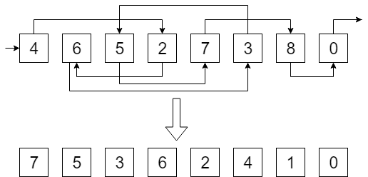

# Внешняя память

Почему мы говорим внезапно посреди лекций про нее?

Мотивация: Мы жили в RAM - модели, которая делает все за O(1). По жизни все сложнее. В RAM у нас 10-100GB. Примерно 200 тактов, чтобы обратиться к ним. Скорость примерно 5-10 GB/s.

Есть HDD. Примерно 1/120 секунды, чтобы обратиться к нему. Разница колоссальная. Скорость примерно 100-200 MB/s.

> П: Ну вы все, что вам Скаков рассказывал про HDD фигня. На самом деле там хомяк такой сидит он там крутится и арифметику считает. Вы ему говорите 2+3, хомяк там подумает-подумает и выдает ответ. 

В оперативке нам помогает кеш.

## Модель внешней памяти

Что у нас есть:

- \\( M \\) - размер RAM

- \\( N \\) - размер внешней памяти(EXT MeM)

- \\( B \\) - кусок размера B, который мы может перетащить из RAM в EXT MeM

Как мы будем оценивать?

Мы будем оценивать количество взаимодействий с памятью: **IO complexity**

Мы не будем думать о работе процессора. Грубо говоря наш процессор супер крутой, мы будем думать только о взаимодействии с памятью.

Input и Output у нас находятся на диске. 

## Примеры

> П: Есть крутой лектор: Максим Бабенко

### Сумма массива.

Дан массив n чисел. Хотим посчитать сумму. Очевидно асимптотика  \\(\lceil \frac n B \rceil\\) = \\(Scan(n)\\). 

Считаем, что 1 число - 1 ячейка памяти. Считаем \\(B\\) чисел, потом следующие и так далее. И за \\(O(1)\\) выводим на диск сумму.

### Мерджим 2 массива.

Дано 2 отсортированных массива длины n, m.

\\(O(Scan(n) + Scan(m))\\) с помощью двух указателей.

### Сортировка 

Сделаем merge sort. Возьмем куски размера B отсортируем и начнем делать merge. Очевидная идея отрабатывает за:

\\( O(\frac n B \log_2 \frac n B ) \\)

Но это медленно, мы можем быстрее. Давайте будем делиться на больше частей

Слить k массивов будет стоить (k+1)B памяти, так как у нас оперативка M, то \\( k = \frac M B\\). Поэтому на самом деле у нас дерево не двоичное в сортировке, а k-ичное. Поэтому можно делать быстрее.

\\( O(\frac n vB \log_{\frac M B} \frac n  B)  = Sort(n) \\)

### Стек во внешней памяти

Первая идея реализации:
1. Разбиваем стек на блоки размера B (размер блока для операций ввода-вывода).
2. Храним текущий активный блок в оперативной памяти.
3. Когда блок заполняется:
   - Записываем его во внешнюю память.
   - Создаем новый пустой блок в оперативной памяти.
4. Когда блок опустошается:
   - Загружаем предыдущий блок из внешней памяти.

Проблема: На границе блоков, чередующиеся операции push и pop могут вызывать частые обращения к внешней памяти, что неэффективно.

Вторая идея (улучшенная):
1. Поддерживаем два блока в оперативной памяти: текущий и буферный.
2. При заполнении 1.5 блоков (текущий полностью и половина буферного):
   - Записываем текущий блок во внешнюю память.
   - Переносим заполненную половину буферного блока в начало текущего.
   - Очищаем буферный блок.
3. При опустошении до 0.5 блока:
   - Загружаем предыдущий блок из внешней памяти в буферный.
   - Переносим оставшиеся элементы текущего блока в конец буферного.
   - Меняем местами текущий и буферный блоки.

Эта реализация обеспечивает амортизированную сложность \\(O(\frac{1}{B})\\) операций ввода-вывода на одну операцию стека, так как каждый элемент участвует в операции ввода-вывода только один раз при записи блока и один раз при чтении.

### Очередь

Будем делать очередь на циклическом буфере. Поддерживаем первый и последний блок. Буквально домашка № 5 по парадигмам.

## List Ranking

### Постановка задачи:

Данная задача заключается в следующем: дан односвязный список, то есть для каждого элемента известно, какой идет следующим за ним. Необходимо для каждого элемента определить, каким он является по счету с конца списка. Расстояние до конца списка будем называть рангом элемента. 

Пример:

Несмотря на простоту задачи в RAM-моделе, во внешней памяти задача имеет нетривиальное решение. Из-за того что все данные лежат хаотично, мы не можем просто пройтись по списку, это может потребовать слишком много операций ввода-вывода.

### Решение:

Давайте дадим каждой вершинке вес.  Пусть теперь у нас у каждой вершины есть вес \\( v_i \\) и ответ это сумма весов всех идущих после данной вершины в односвязном списке.

Посмотрим на 3 подряд идущие вершины. Позамечаем факты, чтобы ничего не поменялось в плане расстояние до конца, когда я удаляю вершину, я должен добавить в следующую после нее вес \\( w_y \\), а если наоборот добавляю, то должен присвоить вес новой \\( r_z + w_z \\) (см. рисунок)

#### Идея:
Решим задачу следующим способом: выкинем из списка какую-то часть элементов, после чего рекурсивно посчитаем ответ для полученного списка. Затем, зная промежуточный ответ, восстановим ответ для исходной задачи. Для решения исходной задачи в самом начале присвоим каждому элементу вес 1.

#### Режим промежуточную задачу Join:

Есть 2 таблички ключ - значение:

$$ k_1,v_1, k_2,v_2 , \dots, k_n, v_n $$

$$ l_1,u_1, l_2,u_2 , \dots, l_n, u_n $$

Причем \\(k_1, \dots , k_n\\) - перестановка и \\(l_1, \dots , l_n\\) - тоже перестановка.

Хочу получить на выходе табличку, где будут храниться пары значений.

Отсортим обе таблицы за \\(O(Sort(n))\\), а потом смерждим за \\(O(n)\\)

Такая задача решается за \\(O(Sort(n))\\).

#### Вернемся к решению:

Сделаем 3 таблицы:

- i: next - Текущий индекс - следующий индекс.

- i: \\(v_i\\) - Индекс - вес.

- \\(rem_i\\) - убранные

Эти три таблицы отсортированы по ключу и сделается за \\(O(Scan(n))\\)

todo: дописать последние 10 минут

